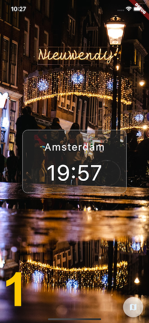

# WorldClock

Simple flutter application that can show World Clock.

### Todos:
- [x] get and show timezone from specified location from API.
- [x] get list of full timezones from API and add ability to change shown clock.
- [x] ability to save and read previous chosen timezone.
- [x] convert static clock to live.
- [x] change theme by DayTime, NightTime
- [x] download and view random background from timezone location.
- [x] change time and location view from simple to a card. -> pic:1
- [x] use user location as default timezone. -> pic:2
- [x] ability to change between analog and digital -> pic:3
- [x] world map background to analog
- [ ] ability to add multiple timezones

### screen-shots :
  
